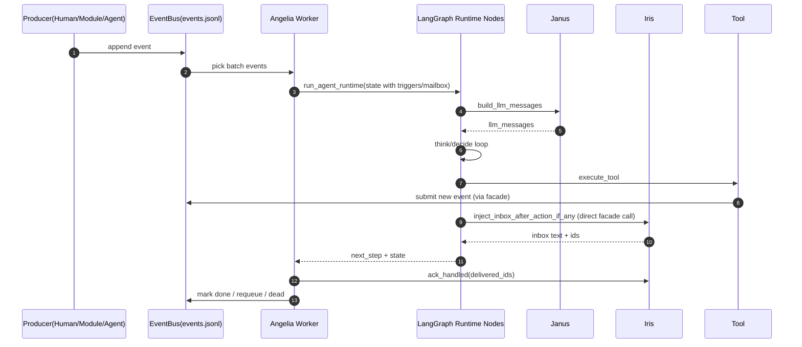
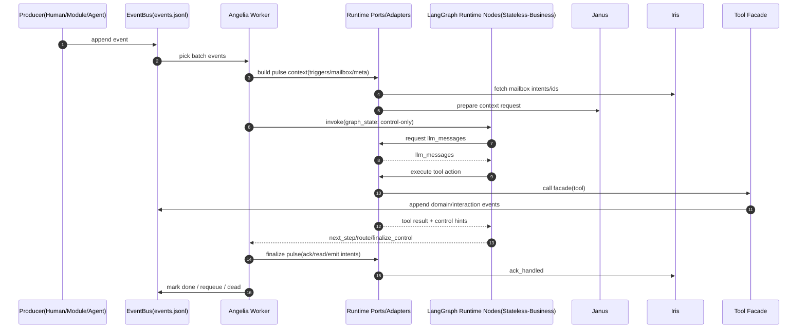
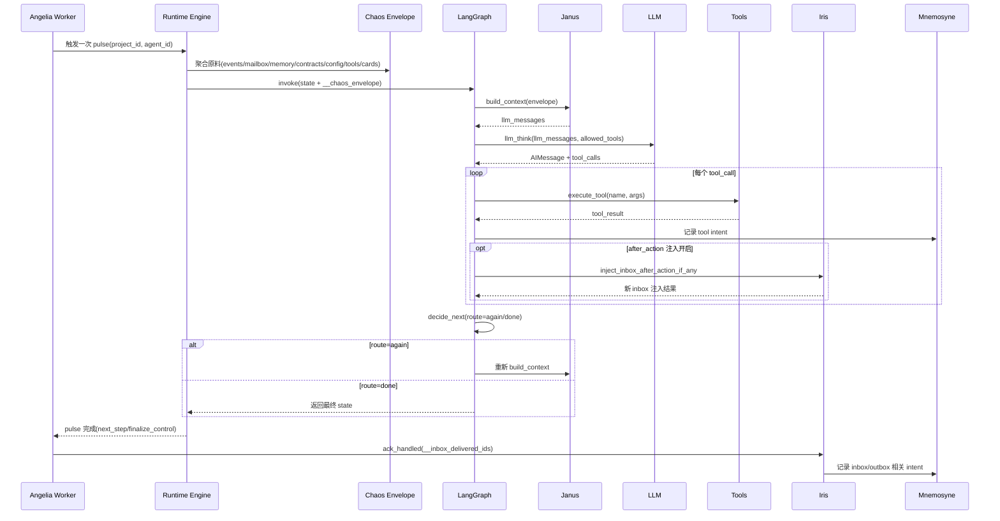

# ADR: LangGraph 运行时边界与状态归属

- 状态: Accepted
- 日期: 2026-02-18
- 决策人: Angelia / Janus / Iris / Agent Runtime 维护者
- 关联文档:
  - `docs/AGENT_EVENT_INTERACTION_PROTOCOL.md`
  - `docs/AGENT_RUNTIME_LANGGRAPH.md`
  - `docs/EVENT_BUS_ARCHITECTURE.md`

## 背景
当前项目在 `lang-graph agent` 重构上存在两类分歧：

1. 节点内外同时持有状态，让节点带业务状态。
2. 状态全部移动到节点外，让节点无业务状态（仅保留执行控制态）。

同时，多智能体事件驱动目前由自研 `Angelia + EventBus + Interaction/Iris` 体系承担，团队在评估是否应由 LangGraph 接管全局编排。

## 问题陈述
需要明确两件事：

1. LangGraph 在系统中的职责边界是什么（执行内核 vs 全局编排）。
2. 节点状态应如何设计，才能降低耦合并保持可测试性、可演进性与故障可恢复性。

## 决策
采用以下决策：

1. LangGraph 定位为“单 Agent、单次 pulse”的执行内核，不接管多智能体全局事件编排。
2. 业务状态全部外置到模块（Angelia/Iris/Hermes/Detach/Mnemosyne）与 EventBus；LangGraph 节点仅保留最小执行控制态。
3. 节点依赖通过 runtime ports/adapters 注入，不在节点中直接绑定业务 facade。

## 允许保留在图内的状态
仅允许以下“瞬时执行控制态”存在于 `RuntimeState`：

1. 路由控制：`route`、`next_step`
2. 循环控制：`loop_count`、`max_rounds`
3. 本轮计算产物：`tool_calls`、`tool_results`、`llm_messages_buffer`
4. 脉冲上下文元信息：`pulse_meta`（只读元信息）

## 不应放在图内的状态
以下状态必须通过模块 API 外置维护，不在节点中承载业务语义：

1. 邮件投递/已读/回执状态（Iris）
2. 事件生命周期与重试/死信状态（EventBus/Angelia）
3. 合约与任务生命周期状态（Hermes/Detach）
4. 业务型持久记忆状态（Mnemosyne 业务规则层）

## 主要收益
1. 降低 LangGraph 节点与业务模块耦合，策略演进不牵连业务状态机。
2. 故障恢复路径清晰，重试与补偿由 EventBus/模块状态机承担。
3. 单元测试颗粒更清楚：节点测控制流，模块测业务状态机。
4. 支持未来替换执行图引擎而不改业务域模型。

## 代价与权衡
1. 需要引入 ports/adapters 层，短期改造成本上升。
2. 节点内部“看起来不够方便”，部分逻辑需经 facade/adapter 间接调用。
3. 需要补齐契约测试，防止注入接口漂移。

## 被拒绝方案
### 方案A: 节点内外同时持有业务状态
拒绝原因：
1. 状态双写与漂移风险高。
2. 故障时一致性边界模糊。
3. 策略变更容易误触业务语义回归。

### 方案B: 由 LangGraph 接管多智能体全局编排
拒绝原因：
1. 与现有 EventBus/Angelia 成熟能力重叠（队列、重试、退避、状态恢复）。
2. 全局并发/调度语义迁移成本和风险高。
3. 违背当前协议中“模块状态机自治”的边界约束。

## 修改前时序（现状，节点存在较强业务依赖）

## 修改后时序（目标，业务状态外置 + 节点仅控制态）

## 实施计划
1. 第1阶段（边界收口）:
   - 在 runtime 增加 `ports.py`，抽象 `context_builder`、`tool_dispatcher`、`inbox_interruptor`。
   - `nodes.py` 仅依赖 ports，不直接 import Angelia/Janus/Iris facade。
2. 第2阶段（状态收敛）:
   - 清点 `RuntimeState` 字段，移除业务态字段，只保留控制态字段。
   - 将业务字段通过 worker/ports 生命周期管理。
3. 第3阶段（验证与护栏）:
   - 新增契约测试：ports 输入输出稳定性、回归时序校验。
   - 增加 lint/测试规则，禁止 runtime nodes 直接依赖业务域 facade。

## 验收标准
1. `gods/agents/runtime/nodes.py` 不再直接依赖 Angelia/Iris/Janus 业务 facade。
2. 节点状态仅包含控制态字段，业务状态由模块持久化并可追踪。
3. 现有事件闭环与重试语义保持不变（无行为回归）。
4. `react_graph` 与 `freeform` 可继续并存并独立演进。

## 失败处置策略（零兼容）
若迁移期间出现稳定性问题：
1. 停止发布并修复当前实现，不引入 legacy/compat 回退分支；
2. 允许在同一主线内做前向修复（hotfix）与配置收敛；
3. 事件总线与模块状态机保持单一语义，不新增旧实现并行路径。

