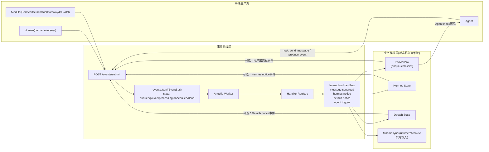

# AGENT EVENT INTERACTION PROTOCOL

## 1. 唯一交互闭环
`Module -> Event -> LLM -> Tool -> Event -> Module`

约束：
1. LLM 不得直接写业务状态。
2. Tool 只能调用模块 facade。
3. 业务状态机仅由各模块维护，EventBus 不承载业务态语义。

## 2. 模块职责
1. `gods/events`：传输与调度（`queued/picked/processing/done/failed/dead`）。
2. `gods/interaction`：统一 Agent 交互控制事件（`interaction.*`）与 handler 分发。
3. `gods/iris`：mailbox 状态机（投递/已读/回执）。
4. `gods/hermes`：协议注册、调用、契约业务状态。
5. `gods/runtime/detach`：任务生命周期业务状态。

## 2.1 人类身份
1. 人类视为特殊 agent：`human.overseer`。
2. 人类->Agent 发送统一走 `interaction.message.sent`，不再使用 `/confess`。

## 3. Tool 规则
1. Tool 必须幂等（建议 `event_id/dedupe_key`）。
2. Tool 失败必须产出失败事件并由模块记录错误。
3. Tool 不得跨域直改存储文件。

## 4. Event 规则
1. 事件 payload 禁止业务状态字段漂移（如 `delivered_at/handled_at/read_at/...`）。
2. 业务回执（已读/处理完成）必须通过模块 API 记录，再反向产出事件。
3. 同一影响动作必须可追踪到对应事件记录。

## 5. 禁行项
1. 禁止 `Module -> Agent内部对象` 旁路调用。
2. 禁止 `LLM -> Store` 直写。
3. 禁止新增 legacy/compat 迁移逻辑。

## 6. Agent Runtime 策略
1. Agent 执行引擎统一为 LangGraph Runtime。
2. 策略仅允许：
   - `react_graph`
   - `freeform`
3. 两种策略均遵循 `Module -> Event -> LLM -> Tool -> Event -> Module` 闭环，不允许旁路。
4. 旧 phase runtime 与旧策略名已移除。

