# Gods Platform 架构图谱（Mermaid 多颗粒度）

> 兼容性结论：当前保持向后兼容。  
> - Project 级 `phase_strategy/phase_mode_enabled` 仍可用。  
> - Agent 级覆盖仅在显式设置 `agent.<id>.phase_strategy` 或 `agent.<id>.phase_enabled` 时生效。  
> - `api/server.py` 保留兼容导出，推荐新入口 `server.py -> api.app:app`。

## 1. 系统全景（L0）
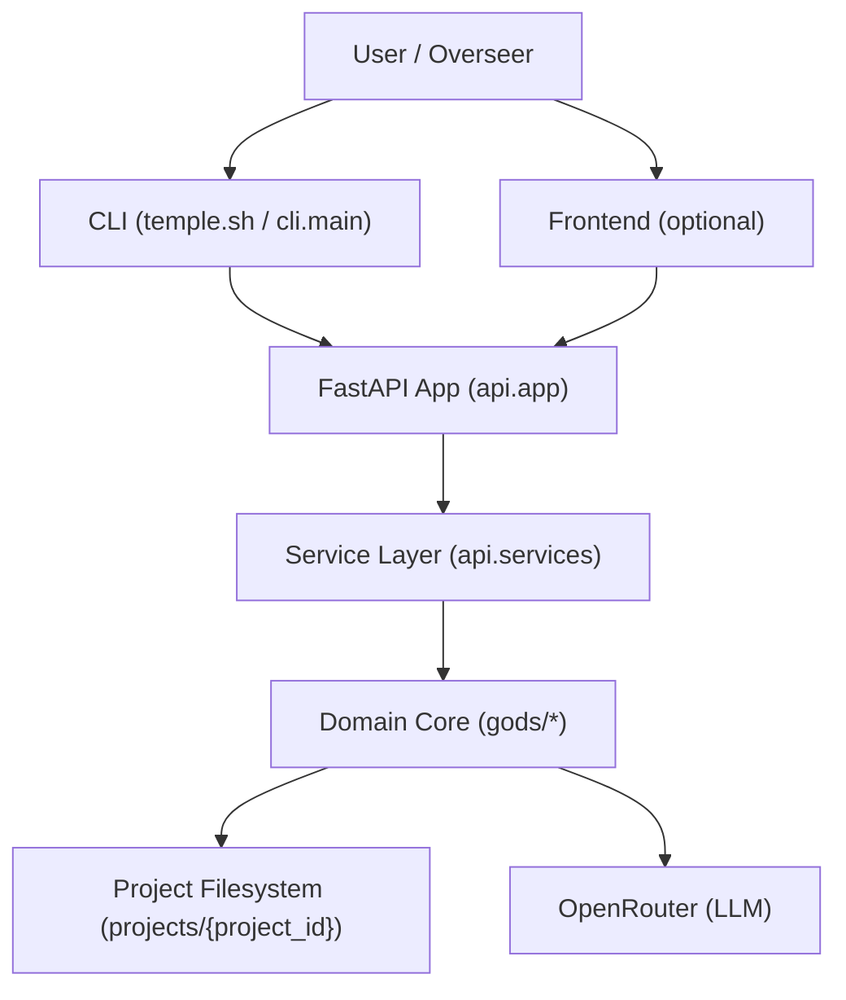

## 2. 分层边界（L1）
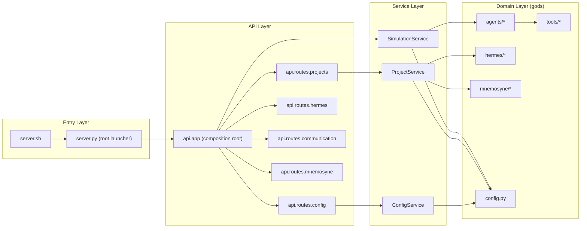

## 3. API 到 Service 调用关系（L2）
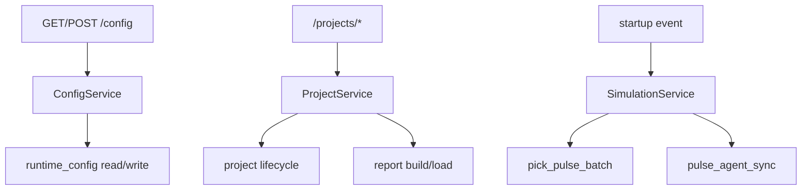

## 4. 调度循环（L3 Runtime）
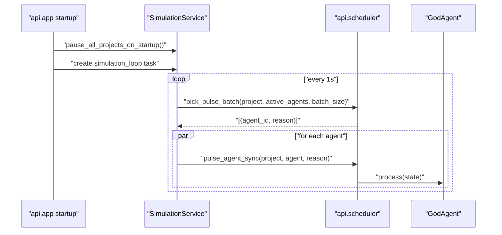

## 5. Agent 执行策略分流（L3 Agent）
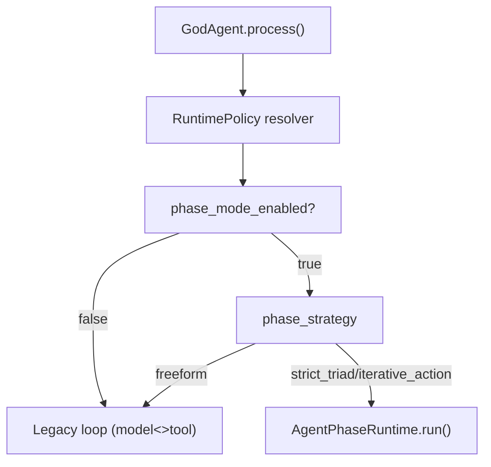

## 6. 配置覆盖优先级（Agent > Project）
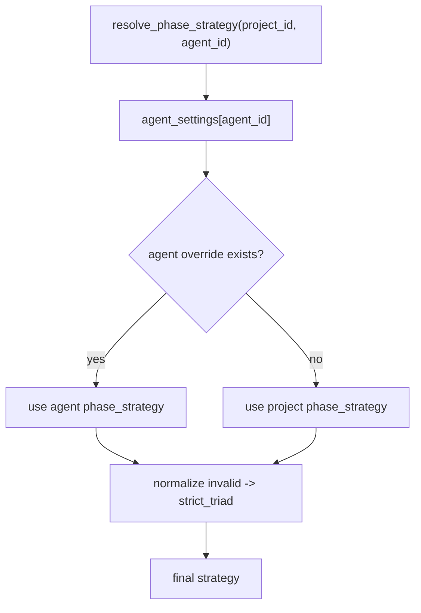

## 7. 严格阶段策略（strict_triad）
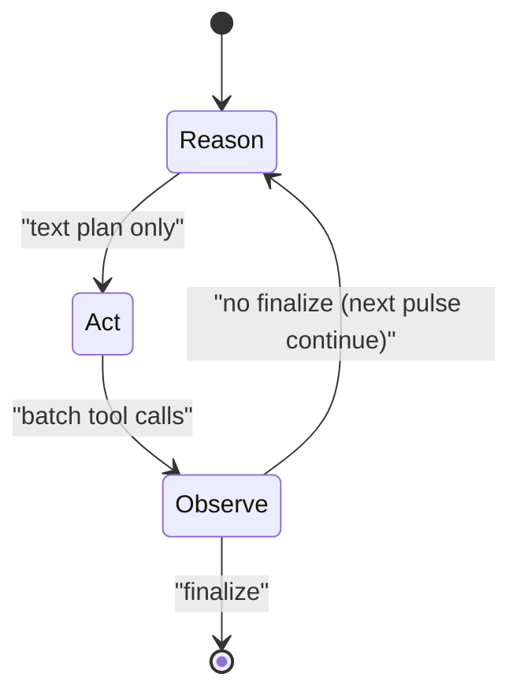

## 8. 迭代策略（iterative_action）
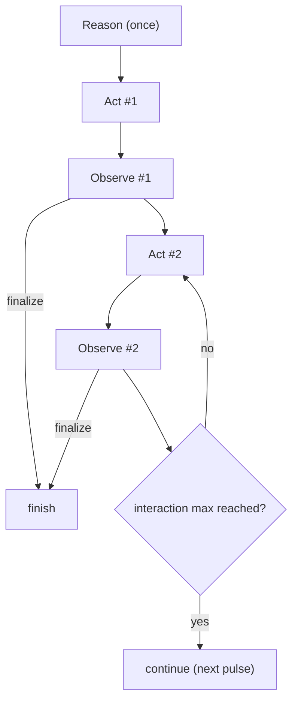

## 9. Hermes 协议总线（L3 Domain）
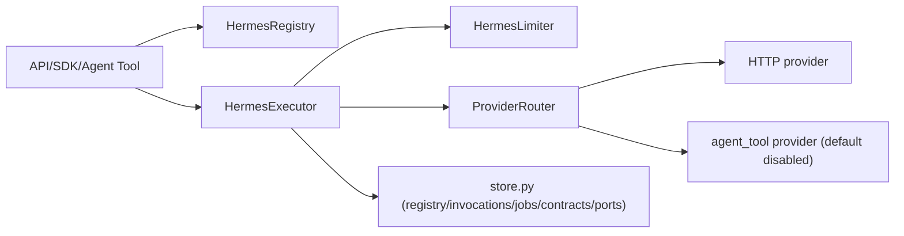

## 10. Mnemosyne 档案流
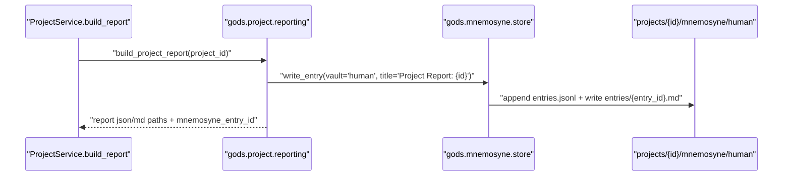

## 11. 配置与安全（/config 脱敏）
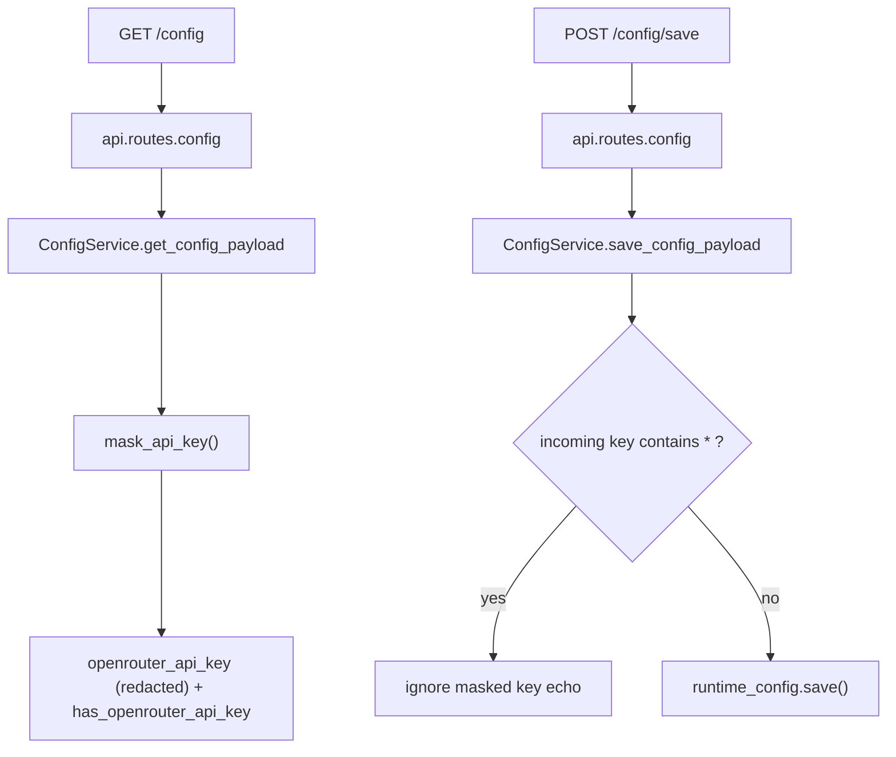

## 12. 项目报告生成链路（Project 内报告）
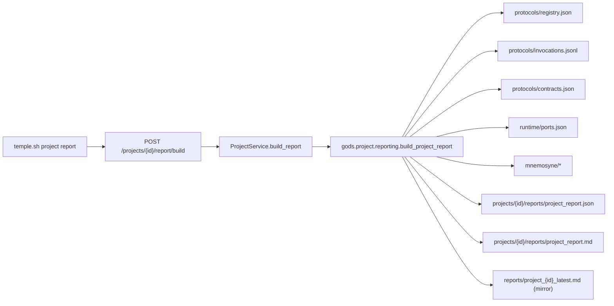

## 13. CLI 命令分发结构
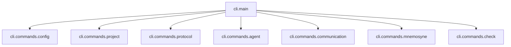

## 14. Project 目录数据平面
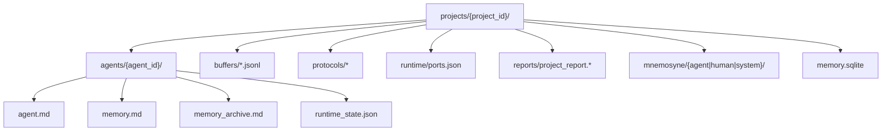

## 15. 兼容层关系图
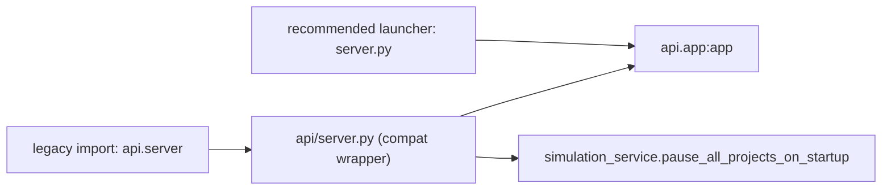

## 16. Agent 间交互方案（消息 + 协议双通道）
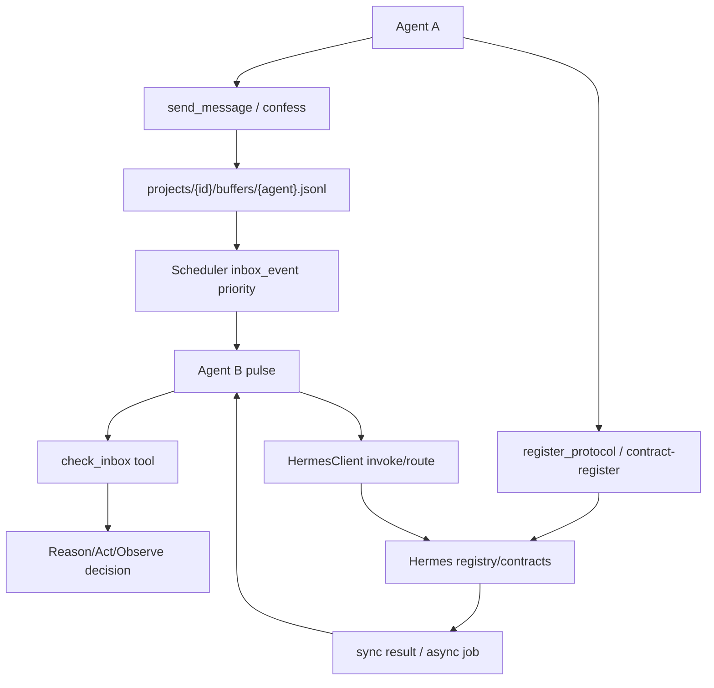

## 17. Agent 工具调用执行链（Model<>Tool）
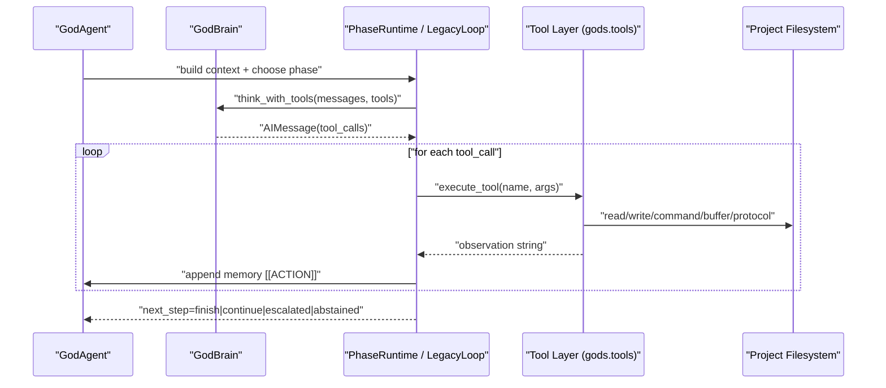

## 18. 契约机制总览（Hermes Contracts）
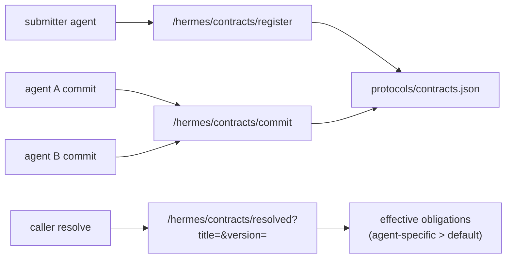

## 19. 契约生命周期（状态与动作）
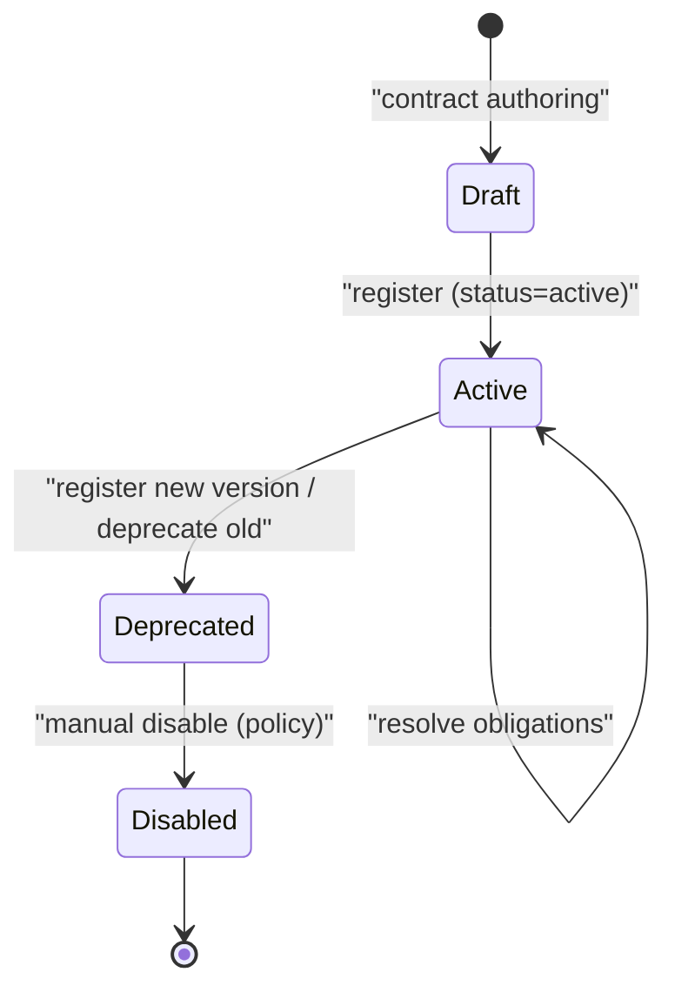

## 20. 契约解析规则（default + 专属职责）
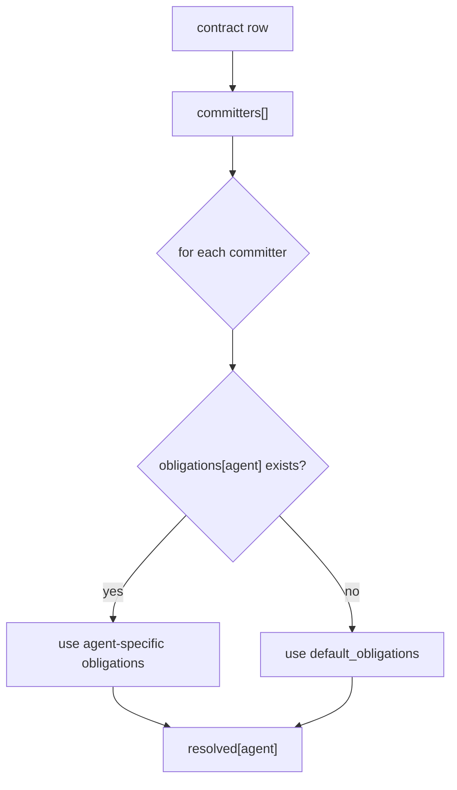

## 21. 契约驱动调用路径（从承诺到执行）
```mermaid
flowchart TD
    Resolve["resolve contract"] --> Plan["agent gets obligations list"]
    Plan --> Impl["agent implements function / endpoint"]
    Impl --> Proto["register_protocol(name@version, provider)"]
    Proto --> Invoke["other agent invoke/route by protocol"]
    Invoke --> Audit["invocations.jsonl + job logs"]
    Audit --> Report["project report + mnemosyne archive"]
```

## 22. 动物世界专项：四代理协作拓扑（grass/sheep/tiger/ground）
```mermaid
flowchart LR
    GND["ground (集成/调度)"] --> GRS["grass (资源供给)"]
    GND --> SHP["sheep (摄食/繁衍)"]
    GND --> TGR["tiger (捕食压力)"]
    SHP --> GRS
    TGR --> SHP
    GRS --> GND
    SHP --> GND
    TGR --> GND
```

## 23. 动物世界专项：协商到实现时序
```mermaid
sequenceDiagram
    participant ground
    participant grass
    participant sheep
    participant tiger
    participant hermes

    ground->>grass: "send_message: propose ecosystem protocol"
    ground->>sheep: "send_message: request sheep obligations"
    ground->>tiger: "send_message: request tiger obligations"

    grass->>hermes: "register_protocol(grass.*)"
    sheep->>hermes: "register_protocol(sheep.*)"
    tiger->>hermes: "register_protocol(tiger.*)"

    ground->>hermes: "contract-register(eco.protocol)"
    grass->>hermes: "contract-commit"
    sheep->>hermes: "contract-commit"
    tiger->>hermes: "contract-commit"
    ground->>hermes: "contract-resolve"

    Note over ground,hermes: "resolved obligations -> implementation plan"
```

## 24. 动物世界专项：运行期调用环（协议主导）
```mermaid
flowchart TD
    Tick["pulse/inbox event"] --> GroundStep["ground step"]
    GroundStep --> CallGrass["route/invoke grass.update_biomass"]
    GroundStep --> CallSheep["route/invoke sheep.update_population"]
    GroundStep --> CallTiger["route/invoke tiger.update_predation"]

    CallGrass --> Hermes["Hermes"]
    CallSheep --> Hermes
    CallTiger --> Hermes

    Hermes --> R1["grass result"]
    Hermes --> R2["sheep result"]
    Hermes --> R3["tiger result"]

    R1 --> Integrate["ground integrate world state"]
    R2 --> Integrate
    R3 --> Integrate
    Integrate --> Persist["write_file / mnemosyne / invocation logs"]
```

## 25. 动物世界专项：消息通道与协议通道并存
```mermaid
flowchart LR
    subgraph Msg["消息通道 (buffers/*.jsonl)"]
      M1["send_message/confess"] --> M2["check_inbox"]
      M2 --> M3["协商文本 / 任务分配"]
    end

    subgraph Proto["协议通道 (Hermes)"]
      P1["register_protocol"] --> P2["invoke/route"]
      P2 --> P3["result + invocations.jsonl + jobs"]
    end

    M3 --> P1
    P3 --> M1
```

## 26. 动物世界专项：观测与复盘
```mermaid
flowchart TD
    Run["animal_world run"] --> Log1["agents/*/memory.md"]
    Run --> Log2["protocols/invocations.jsonl"]
    Run --> Log3["mnemosyne/human entries"]

    Log1 --> Report["project report build"]
    Log2 --> Report
    Log3 --> Report

    Report --> Out1["projects/{id}/reports/project_report.json"]
    Report --> Out2["projects/{id}/reports/project_report.md"]
    Report --> Out3["reports/project_{id}_latest.md"]
```
