# Gods Platform 架构图谱（Mermaid 多颗粒度）

> 当前结论：系统采用单轨实现。  
> - Project 级 `phase_strategy/phase_mode_enabled` 生效。  
> - Agent 级覆盖在显式设置 `agent.<id>.phase_strategy` 或 `agent.<id>.phase_enabled` 时生效。  
> - 服务入口为 `server.py -> api.app:app`。

## 1. 系统全景（L0）
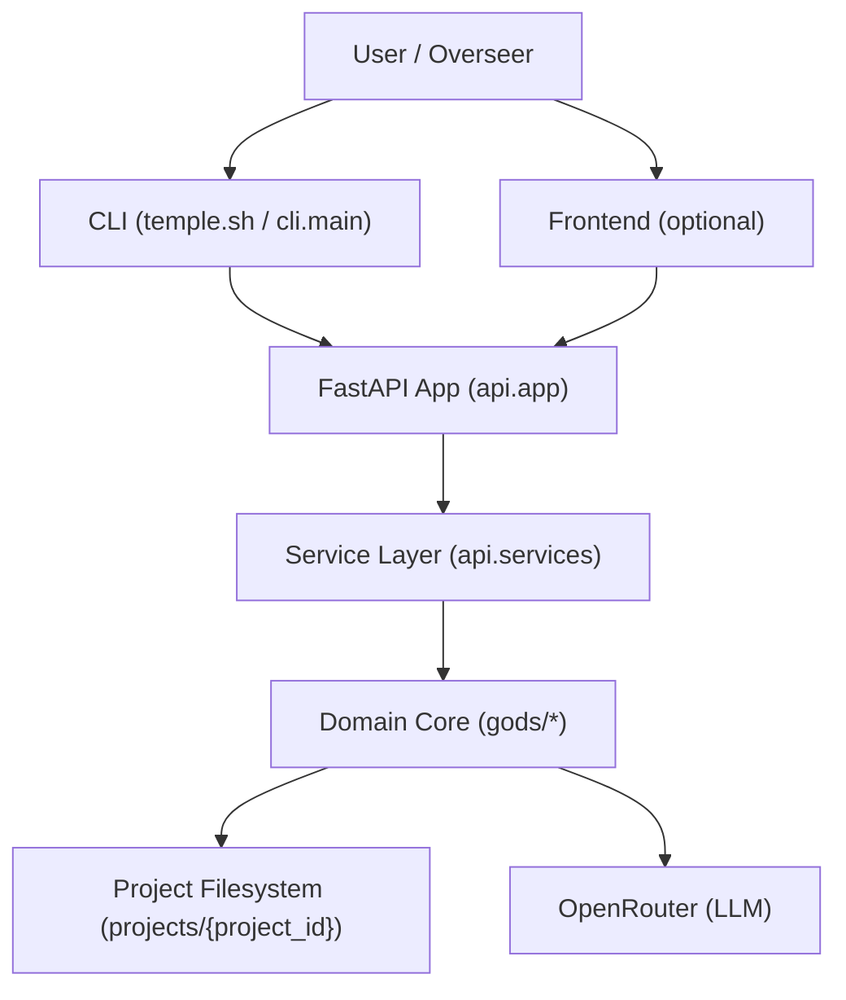

## 2. 分层边界（L1）
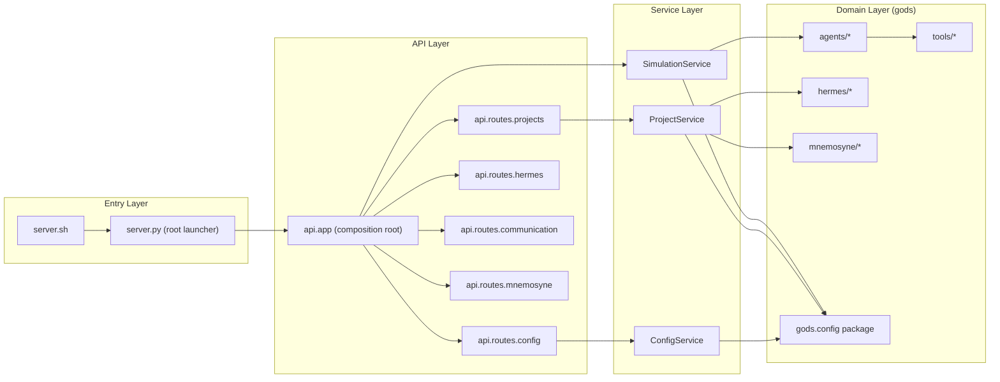

## 3. API 到 Service 调用关系（L2）
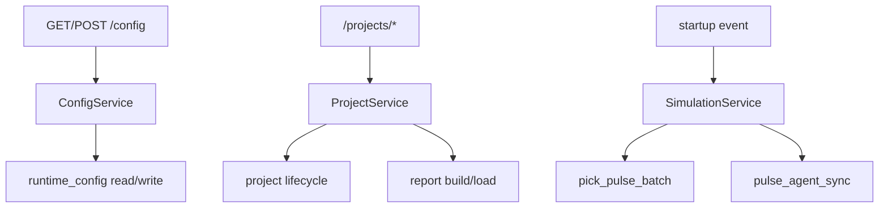

## 4. 调度循环（L3 Runtime）
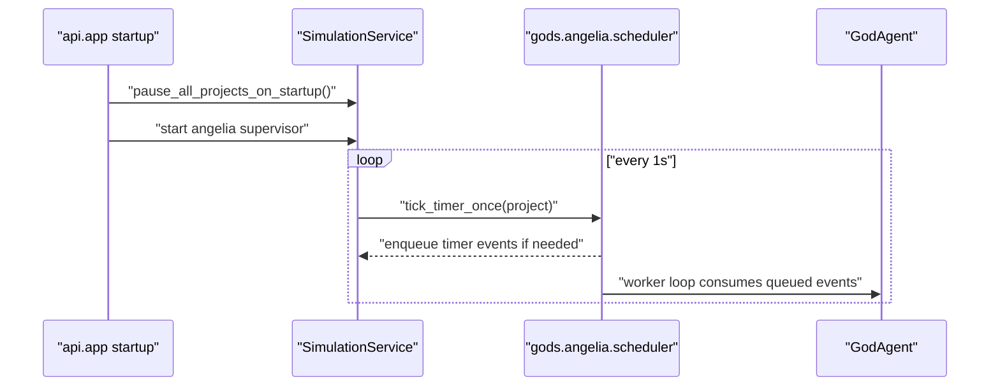

## 5. Agent 执行策略分流（L3 Agent）
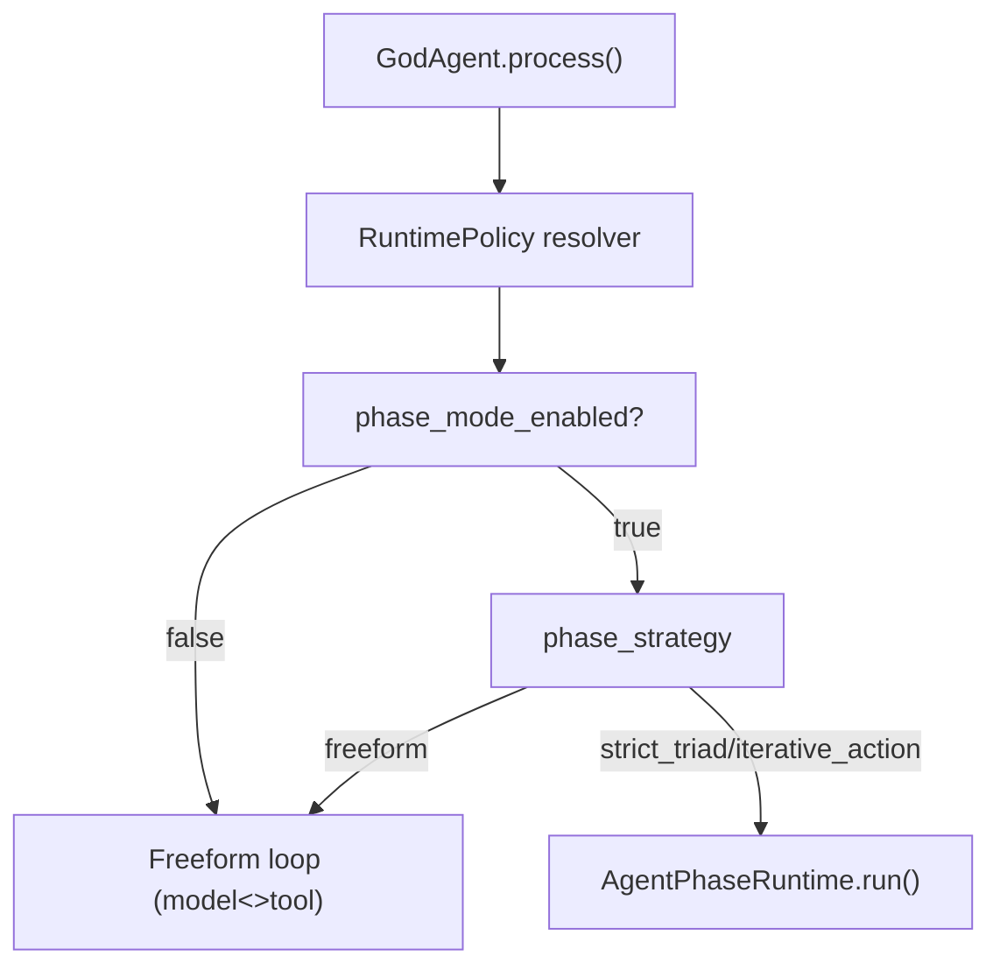

## 6. 配置覆盖优先级（Agent > Project）
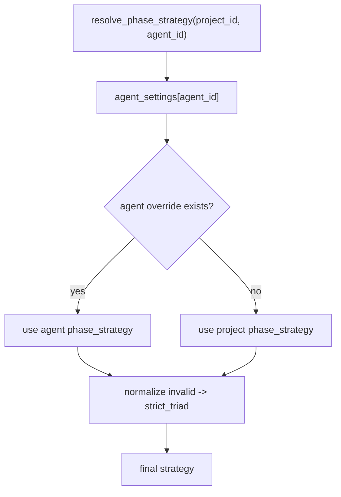

## 7. 严格阶段策略（strict_triad）
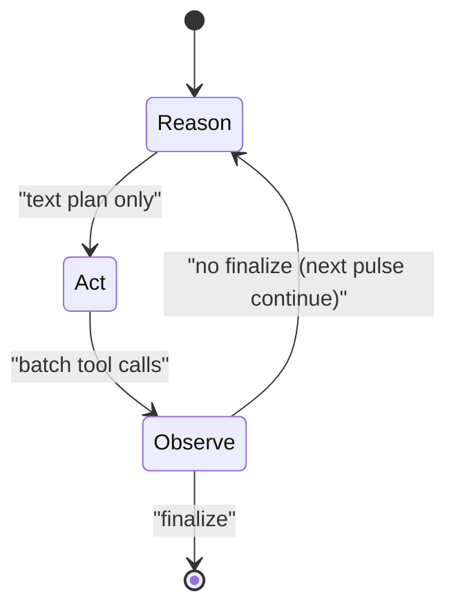

## 8. 迭代策略（iterative_action）
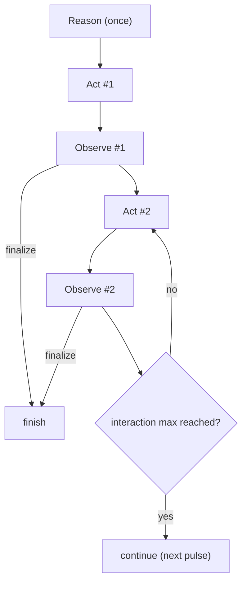

## 9. Hermes 协议总线（L3 Domain）
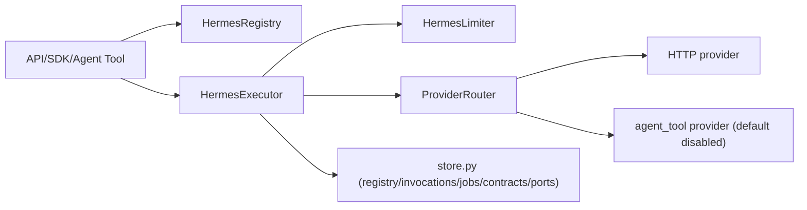

## 10. Mnemosyne 档案流
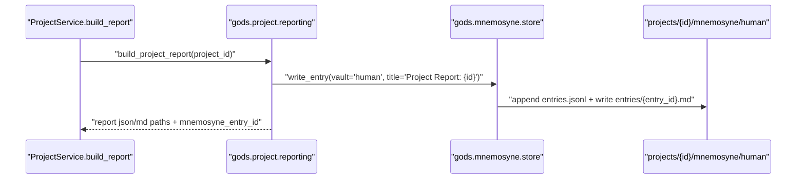

## 11. 配置与安全（/config 脱敏）
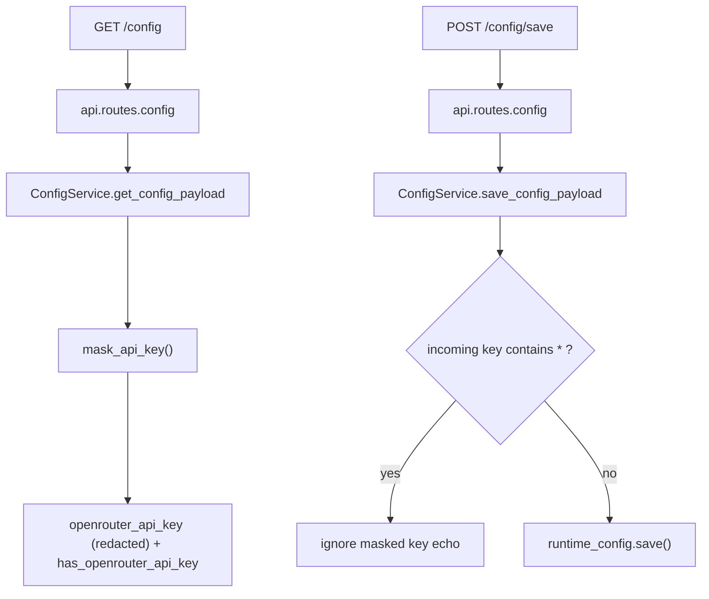

## 12. 项目报告生成链路（Project 内报告）
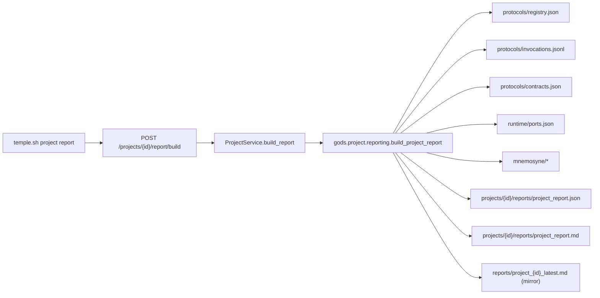

## 13. CLI 命令分发结构
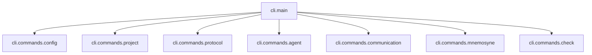

## 14. Project 目录数据平面
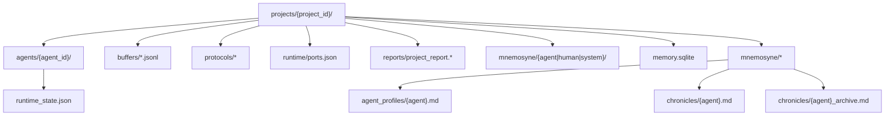

## 15. 启动入口关系图
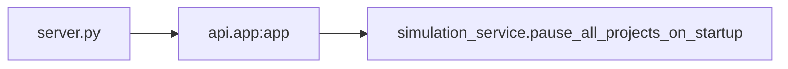

## 16. Agent 间交互方案（消息 + 协议双通道）
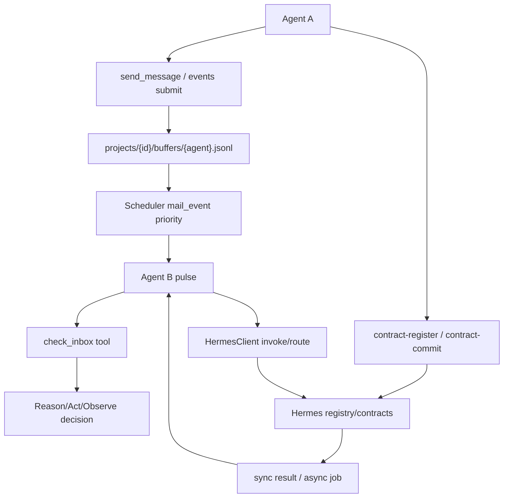

## 17. Agent 工具调用执行链（Model<>Tool）
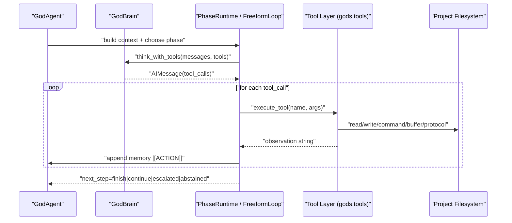

## 18. 契约机制总览（Hermes Contracts）
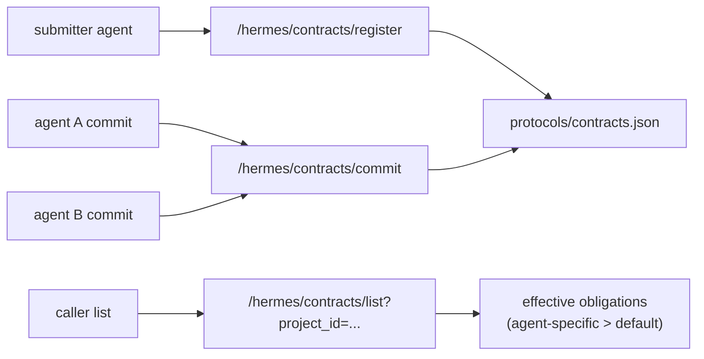

## 19. 契约生命周期（状态与动作）
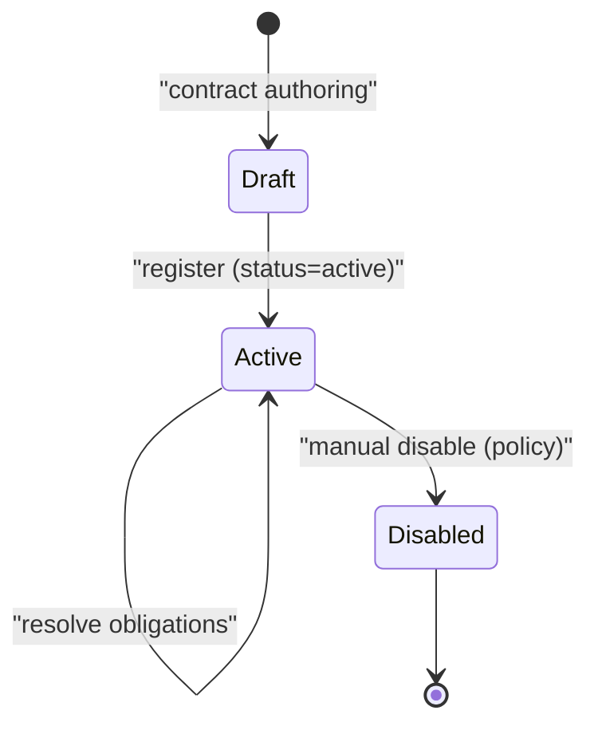

## 20. 契约解析规则（default + 专属职责）
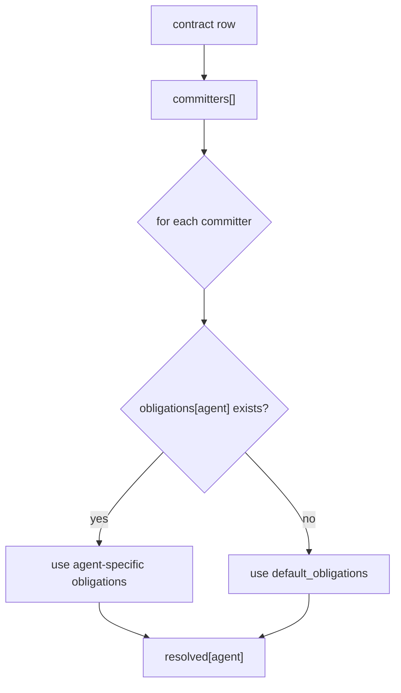

## 21. 契约驱动调用路径（从承诺到执行）
```mermaid
flowchart TD
    Resolve["resolve contract"] --> Plan["agent gets obligations list"]
    Plan --> Impl["agent implements function / endpoint"]
    Impl --> Proto["contract-register + contract-commit"]
    Proto --> Invoke["other agent invoke/route by protocol"]
    Invoke --> Audit["invocations.jsonl + job logs"]
    Audit --> Report["project report + mnemosyne archive"]
```

## 22. 动物世界专项：四代理协作拓扑（grass/sheep/tiger/ground）
```mermaid
flowchart LR
    GND["ground (集成/调度)"] --> GRS["grass (资源供给)"]
    GND --> SHP["sheep (摄食/繁衍)"]
    GND --> TGR["tiger (捕食压力)"]
    SHP --> GRS
    TGR --> SHP
    GRS --> GND
    SHP --> GND
    TGR --> GND
```

## 23. 动物世界专项：协商到实现时序
```mermaid
sequenceDiagram
    participant ground
    participant grass
    participant sheep
    participant tiger
    participant hermes

    ground->>grass: "send_message: propose ecosystem protocol"
    ground->>sheep: "send_message: request sheep obligations"
    ground->>tiger: "send_message: request tiger obligations"

    ground->>hermes: "contract-register(eco.protocol)"
    grass->>hermes: "contract-commit"
    sheep->>hermes: "contract-commit"
    tiger->>hermes: "contract-commit"
    ground->>hermes: "contract-list (check missing_committers)"

    Note over ground,hermes: "resolved obligations -> implementation plan"
```

## 24. 动物世界专项：运行期调用环（协议主导）
```mermaid
flowchart TD
    Tick["pulse/inbox event"] --> GroundStep["ground step"]
    GroundStep --> CallGrass["route/invoke grass.update_biomass"]
    GroundStep --> CallSheep["route/invoke sheep.update_population"]
    GroundStep --> CallTiger["route/invoke tiger.update_predation"]

    CallGrass --> Hermes["Hermes"]
    CallSheep --> Hermes
    CallTiger --> Hermes

    Hermes --> R1["grass result"]
    Hermes --> R2["sheep result"]
    Hermes --> R3["tiger result"]

    R1 --> Integrate["ground integrate world state"]
    R2 --> Integrate
    R3 --> Integrate
    Integrate --> Persist["write_file / mnemosyne / invocation logs"]
```

## 25. 动物世界专项：消息通道与协议通道并存
```mermaid
flowchart LR
    subgraph Msg["消息通道 (buffers/*.jsonl)"]
      M1["send_message/events submit"] --> M2["check_inbox"]
      M2 --> M3["协商文本 / 任务分配"]
    end

    subgraph Proto["协议通道 (Hermes)"]
      P1["contract-register/commit"] --> P2["invoke/route"]
      P2 --> P3["result + invocations.jsonl + jobs"]
    end

    M3 --> P1
    P3 --> M1
```

## 26. 动物世界专项：观测与复盘
```mermaid
flowchart TD
    Run["animal_world run"] --> Log1["mnemosyne/chronicles/*.md"]
    Run --> Log2["protocols/invocations.jsonl"]
    Run --> Log3["mnemosyne/human entries"]

    Log1 --> Report["project report build"]
    Log2 --> Report
    Log3 --> Report

    Report --> Out1["projects/{id}/reports/project_report.json"]
    Report --> Out2["projects/{id}/reports/project_report.md"]
    Report --> Out3["reports/project_{id}_latest.md"]
```

```mermaid
sequenceDiagram
    autonumber
    participant EQ as AngeliaQueue
    participant W as AngeliaWorker
    participant IS as InboxStore
    participant AG as GodAgent.process
    participant PR as AgentPhaseRuntime._think
    participant J as JanusService.build_llm_messages
    participant S as StructuredV1Strategy
    participant B as GodBrain.think_with_tools (LLM1)

    Note over EQ,W: 触发源：mail_event / manual / system / timer
    EQ->>W: pick_next_event(agent_id,event_type,payload)

    rect rgb(245,245,245)
    Note over W,IS: Pulse启动前运行时注入
    W->>IS: fetch_inbox_context(project_id,agent_id,budget)
    IS-->>W: [Event Inbox Delivery]文本 + delivered_ids(可空)
    W->>AG: state.messages += HumanMessage("PULSE_EVENT: reason")
    W->>AG: state.context = "Autonomous pulse reason=..."
    W->>AG: (可选)state.messages += SystemMessage(name="event_inbox",content=正文)
    end

    AG->>PR: run(strategy=strict_triad 或 iterative_action)

    loop LLM调用#1: Reason阶段
        PR->>J: build_llm_messages(req{state,directives,local_memory,inbox_hint,phase_block,tools_desc})
        J->>S: strategy.build(req)
        S-->>J: system_blocks + recent_messages(来自state.messages预算筛选)
        J-->>PR: llm_messages=[SystemMessage(拼接blocks)] + recent_messages
        PR->>B: think_with_tools(llm_messages,tools)
        B-->>PR: AIMessage(reason输出)
    end

    loop LLM调用#2..N: Act阶段(每轮一次)
        PR->>J: build_llm_messages(最新state)
        J->>S: build(同上)
        S-->>J: blocks + recent_messages
        J-->>PR: llm_messages
        PR->>B: think_with_tools(...)
        B-->>PR: AIMessage(act工具调用列表)

        Note over PR: 执行每个工具后，可能追加新上下文
        opt after_action有新inbox
            PR->>IS: fetch_inbox_context(...)
            IS-->>PR: 新正文 + ids
            PR->>PR: state.messages追加event_inbox SystemMessage
        end
    end

    loop LLM调用#(最后): Observe阶段(每轮一次)
        PR->>J: build_llm_messages(再次读取最新state)
        J->>S: build
        S-->>J: blocks + recent_messages
        J-->>PR: llm_messages
        PR->>B: think_with_tools(...)
        B-->>PR: AIMessage(文本或finalize工具调用)
    end

    alt observe调用finalize
        PR-->>AG: next_step=finish
    else 未finalize
        PR-->>AG: next_step=continue
    end

    AG-->>W: new_state + __inbox_delivered_ids
    W->>IS: ack_handled(delivered_ids)
    W->>EQ: mark_event_done / 失败则requeue或dead

```


```mermaid
sequenceDiagram
    autonumber
    participant EQ as AngeliaQueue
    participant W as AngeliaWorker
    participant AG as "GodAgent.process (freeform)"
    participant J as JanusService
    participant S as StructuredV1
    participant B as "LLM1 (GodBrain)"
    participant T as Tools

    EQ->>W: pick event (inbox/manual/system/timer)
    W->>AG: 注入 PULSE_EVENT 与 reason（可选 event_inbox 正文）

    loop 每轮自由执行（最多 tool_loop_max）
        AG->>J: build_llm_messages(最新 state)
        J->>S: build structured_v1 + recent_messages
        S-->>J: system_blocks + recent_messages
        J-->>AG: llm_messages
        AG->>B: think_with_tools(llm_messages, tools)
        B-->>AG: AIMessage(content + tool_calls)

        alt 无 tool_calls
            AG-->>W: next_step=finish
        else 有 tool_calls
            loop 执行本轮全部 tool_calls
                AG->>T: execute_tool(name,args)
                T-->>AG: observation/result
                AG->>AG: 写入 state.messages 与 chronicle
            end
            opt after_action 有新 inbox
                AG->>AG: 注入 event_inbox 到 state.messages
            end
        end
    end

    alt 达到循环上限仍有工作
        AG-->>W: next_step=continue
    end

    W->>W: ack handled inbox + mark event done/requeue

```

```mermaid
sequenceDiagram
    autonumber
    participant CLI as "CLI / Human"
    participant API as "FastAPI Routes"
    participant SVC as "api/services"
    participant CFG as "gods.config"
    participant ANG as "gods.angelia.scheduler"
    participant AST as "gods.angelia.store"
    participant IBS as "gods.iris.store"
    participant WK as "gods.angelia.worker"
    participant AG as "gods.agents.base.GodAgent"
    participant PH as "gods.agents.phase_runtime"
    participant JAN as "gods.janus.service"
    participant JSTR as "gods.janus.structured_v1"
    participant BRAIN as "gods.agents.brain (LLM)"
    participant TOOLS as "gods.tools.*"
    participant HERMES as "gods.hermes.service"
    participant MNE as "Mnemosyne (chronicles/profiles)"

    Note over API,SVC: 启动期
    API->>SVC: startup_event()
    SVC->>ANG: start()
    SVC->>CFG: 读取项目配置
    SVC->>AST: 严格健康检查（发现 legacy 文件直接失败）

    Note over CLI,API: 事件入口（events submit/send_message/manual/timer）
    CLI->>API: /events/submit
    API->>IBS: 写 inbox message (queued)（若是消息类）
    API->>ANG: enqueue_event(project_id,agent_id,event_type,payload)

    ANG->>AST: 持久化 EventRecord(queued)
    ANG->>WK: notify(agent mailbox)

    loop 每个活跃 agent 单 worker 常驻
        WK->>AST: pick_next_event(priority+FIFO+cooldown策略)
        AST-->>WK: event
        WK->>WK: 构建 pulse state (PULSE_EVENT/reason)
        WK->>IBS: fetch_inbox_context(budget)
        IBS-->>WK: [Event Inbox Delivery] + delivered_ids(可空)

        WK->>AG: agent.process(state)
        AG->>MNE: 读取 directives/profile + local chronicle
        AG->>PH: 进入 phase runtime (或 freeform)

        loop 每次 LLM 调用
            PH->>JAN: build_llm_messages(req)
            JAN->>JSTR: 组装 structured_v1(system blocks + recent messages)
            JSTR-->>JAN: ContextBuildResult
            JAN-->>PH: llm_messages
            PH->>BRAIN: think_with_tools(llm_messages, tools)
            BRAIN-->>PH: AIMessage(tool_calls/content)
            PH->>TOOLS: execute tool calls
            TOOLS-->>PH: observation/result

            opt 工具为 Hermes 类
                TOOLS->>HERMES: register/invoke/route/contracts/ports
                HERMES-->>TOOLS: result/error
            end

            PH->>MNE: 追加 chronicle / observation
        end

        AG-->>WK: new_state(next_step, delivered_ids)
        WK->>IBS: ack_handled(delivered_ids)
        WK->>AST: mark_done / requeue / dead
    end

    Note over API,CLI: 观测与调试
    CLI->>API: /agents/status /events /project report
    API->>AST: 读取事件/状态
    API->>MNE: 读取归档/报告
    API-->>CLI: JSON/摘要输出
```

```mermaid
flowchart LR
    subgraph RT["运行时层"]
        E["Angelia Event Queue"]
        W["Worker"]
        G["GodAgent.process"]
    end

    subgraph MEM["Mnemosyne 资产层"]
        P["agent_profiles/*.md"]
        C["chronicles/*.md"]
        A["chronicles/*_archive.md"]
        T["task_state/*.json (task_card)"]
        R["runtime_events/*.jsonl"]
        POL["memory_policy.json (strict)"]
        TOK["token_io/*.jsonl"]
        CR["context_reports/*.jsonl"]
        ID["inbox_digest/*.jsonl"]
        CMP["Compaction Engine"]
    end

    subgraph JAN["Janus 构建层 structured_v1"]
        JP["read_profile()"]
        JC["load_chronicle_for_context()"]
        JT["read_task_state()"]
        JI["build_inbox_overview()"]
        JO["list_observations()"]
        ASM["assemble_llm_messages()"]
        SYS["SystemMessage"]
    end

    subgraph LLM["推理层"]
        B["Brain.think_with_tools"]
        O["AIMessage / Tool Calls"]
    end

    E --> W --> G
    G -->|"record_intent"| POL
    POL -->|"to_chronicle"| C
    POL -->|"to_runtime_log"| R
    C --> CMP
    CMP -->|"rewrite compacted"| C
    CMP -->|"archive old"| A

    G -->|"update task state"| T
    B -->|"token usage"| TOK

    P --> JP
    C --> JC
    T --> JT
    R --> JI
    R --> JO

    JP --> ASM
    JC --> ASM
    JT --> ASM
    JI --> ASM
    JO --> ASM

    ASM --> SYS --> B --> O --> G
    ASM -->|"write build report"| CR
    W -->|"inbox delivery digest"| ID

```
