# Backend Modules Runtime Map

## 0. Conventions
- SSOT: single source of truth.
- Wake event: Angelia queue event (`angelia_events.jsonl`).
- Inbox message: business message record (`inbox_events.jsonl`).
- Outbox receipt: sender-side delivery status (`outbox_receipts.jsonl`).
- Config source: `config.json` via `gods.config` package.
- Boundary rule: `api/routes -> api/services -> gods.<domain>.facade`.

## 1. Global Layered View (Mermaid)
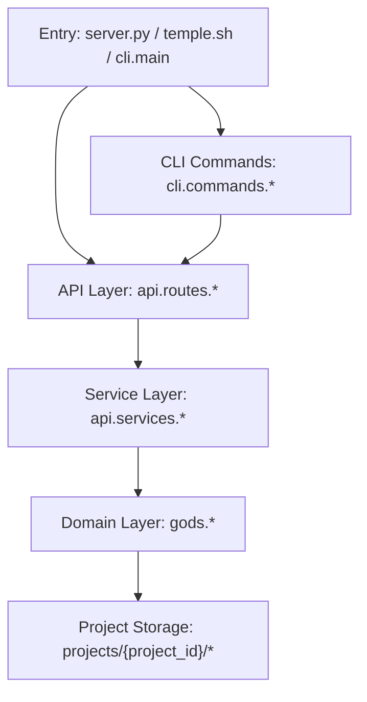

## 2. Module Responsibilities
### api.routes
- HTTP protocol adapter.
- Input validation and status code shaping.
- No domain orchestration logic.

### api.services
- Use-case orchestration for project/config/simulation.
- Runtime lifecycle wiring (start/stop/reconcile/report).

### gods.config
- Typed models, load/save, migration, normalization.
- Runtime singleton (`runtime_config`) as config access entry.

### gods.angelia
- Event queue scheduler, worker lifecycle, wakeup and timer injection.
- Agent runtime state tracking (`angelia_agents.json`).

### gods.iris (Iris)
- Inbox message persistence and state transitions.
- Outbox receipt updates and ack handling.

### gods.agents + phase_runtime
- Agent pulse process entry.
- Phase strategy execution (`strict_triad`/`iterative_action`/`freeform`).

### gods.janus
- Context build strategy resolution and assembly.
- Context reports and context preview generation.

### gods.mnemosyne
- Typed memory intent sink and policy routing.
- Chronicle compaction and archive storage.

### gods.hermes
- Protocol registry/invocation/route/contracts/ports.
- Provider execution and policy guard.

### gods.runtime (docker/detach/backend)
- Command execution backend dispatch (`local`/`docker`).
- Detach background job governance and log access.

### gods.tools
- Agent tools: filesystem/execution/communication/hermes/mnemosyne wrappers.
- Territory and policy guardrails.

### cli.commands
- Human-facing command entry and output rendering.
- Calls HTTP APIs only.

## 3. Inter-Module Dependency Graph (Mermaid)
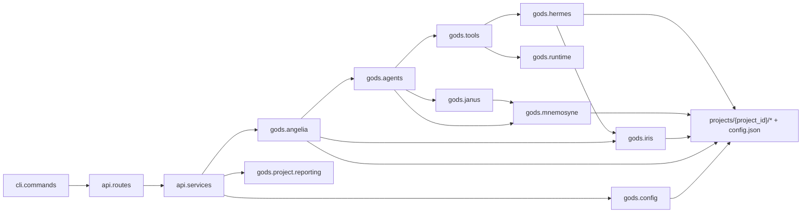

## 4. Per-Module Internal Runtime Mermaid

### 4.1 Global dependency flow
Input: CLI/API requests.
Core state: runtime config + project files.
Main flow: route -> service -> domain -> storage.
Output: API responses / persisted state.
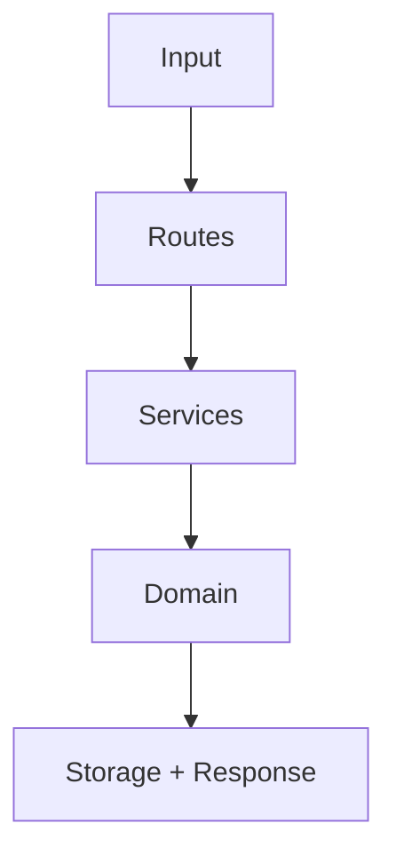

### 4.2 Angelia supervisor/worker
Input: enqueue/wake/timer tick.
Core state: events queue + agent runtime status.
Main flow: enqueue -> pick -> process -> done/requeue/dead.
Output: next wakeup eligibility + metrics.
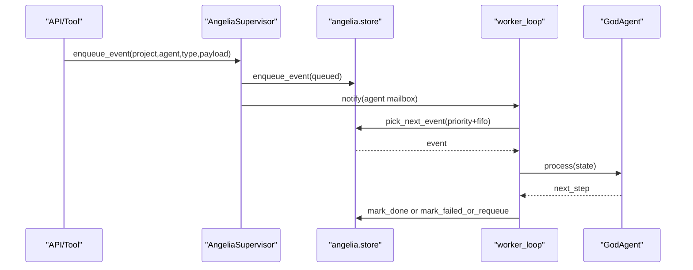

### 4.3 Agent pulse execution
Input: pulse state + reason.
Core state: phase strategy + messages + tool results.
Main flow: reason -> act -> observe/finalize or continue.
Output: next_step + updated state window.
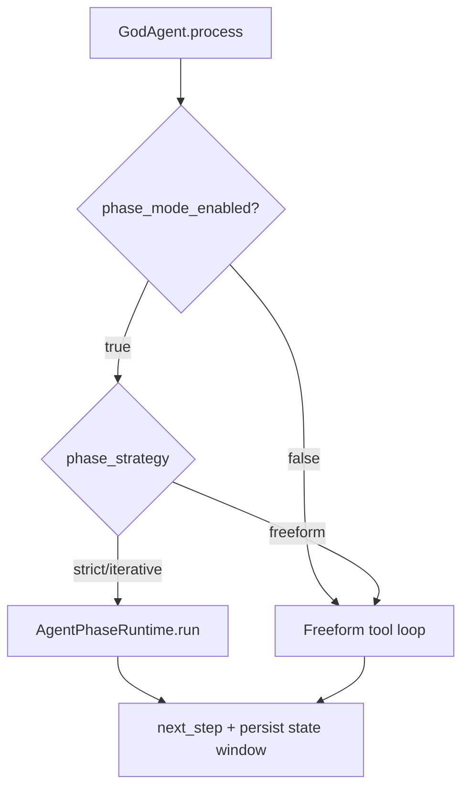

### 4.4 Janus context build
Input: ContextBuildRequest.
Core state: config budgets + profile + chronicle + inbox + state window.
Main flow: resolve cfg -> select strategy -> assemble messages -> report.
Output: llm_messages + context report.
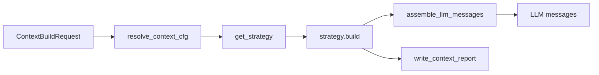

### 4.5 Mnemosyne memory sink + compaction
Input: typed MemoryIntent.
Core state: memory policy + chronicle/runtime logs.
Main flow: resolve policy -> render template -> write sinks -> compact if needed.
Output: memory decision and durable records.
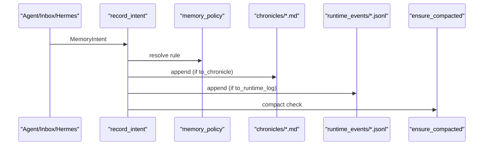

### 4.6 Hermes invoke/route/contracts
Input: protocol call/route/contract commands.
Core state: registry/contracts/jobs/limits.
Main flow: resolve target -> validate schema/limits -> provider route -> persist invocation.
Output: sync result or async job state.
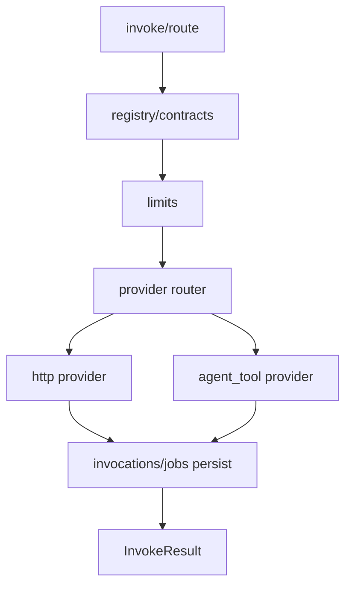

### 4.7 Config load/normalize/save
Input: config.json or API save payload.
Core state: typed models + normalization rules.
Main flow: load -> migrate legacy -> normalize -> runtime singleton -> save.
Output: normalized config state.
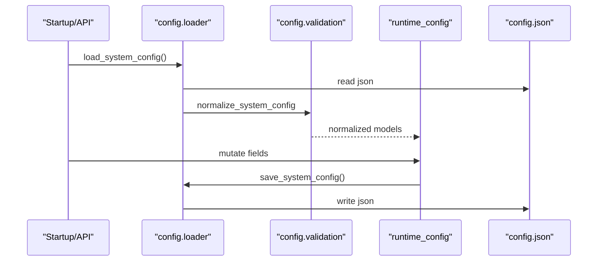

### 4.8 Runtime backend dispatch
Input: run_command call.
Core state: project executor policy + limits.
Main flow: validate command -> resolve backend -> execute -> format result.
Output: safe tool response.
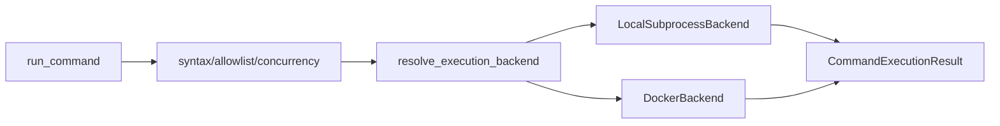

### 4.9 CLI -> API -> Domain
Input: CLI command.
Core state: HTTP request params + project context.
Main flow: command handler -> HTTP route -> service/domain.
Output: JSON/text to user.
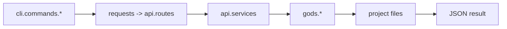

## 5. SSOT Table
| Fact | SSOT | Notes |
|---|---|---|
| Wake events | `projects/{project}/runtime/angelia_events.jsonl` | Only Angelia queue truth |
| Agent runtime status | `projects/{project}/runtime/angelia_agents.json` | Managed by Angelia store |
| Inbox business messages | `projects/{project}/runtime/inbox_events.jsonl` | Source for message content/state |
| Outbox receipts | `projects/{project}/runtime/outbox_receipts.jsonl` | Sender-side delivery state |
| Context reports | `projects/{project}/mnemosyne/context_reports/{agent}.jsonl` | Janus build reports |
| Chronicle memory | `projects/{project}/mnemosyne/chronicles/{agent}.md` | Compaction-aware |
| Protocol registry | `projects/{project}/protocols/registry.json` | Hermes protocol truth |
| Config | `config.json` via `gods.config` | Only typed load/save path |

## 6. Forbidden Paths
- Do not re-introduce `api.scheduler` compatibility layer.
- Do not add CLI commands: `broadcast`, `prayers`, `pulse`, `inbox events`.
- Do not add legacy context shim module under `gods.agents.context_policy`.
- Do not add legacy memory adapter API (`record_memory_event`).
- Do not bypass `gods.config` for config load/save/migration.
- Do not create parallel wake-event stores outside Angelia queue.
