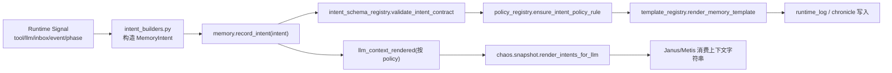

# MemoryIntent 设计与开发指南（Zero-Compat）

本文档定义 `MemoryIntent` 在当前架构中的定位、约束与开发方式。目标是让记忆管线具备以下特性：

- 单一记忆载体：运行时信号统一转为 `MemoryIntent`
- 单一入库入口：统一通过 `record_intent(...)`
- 单一注入路径：LLM 上下文注入由 Chaos 统一执行
- 零兼容：未注册 `intent_key` 一律拒绝

---

## 1. 设计原理

### 1.1 三条管线边界

- `Event`：调度管线（Angelia/事件总线）
- `MemoryIntent`：记忆管线（Mnemosyne）
- `Chaos Snapshot`：原料管线（策略运行输入）

`MemoryIntent` 负责把“运行时发生了什么”转成稳定语义对象，后续由策略决定是否用于上下文或持久化。

### 1.2 为什么必须 Intent 化

- 避免每个模块各自拼文本，造成语义漂移
- 保证同一事件在 runtime_log / chronicle / llm_context 的来源一致
- 能做强校验（字段、类型、key/payload 一致性）
- 能做强治理（注册、审计、模板、策略开关）

### 1.3 Zero-Compat 原则

- 未注册 `intent_key` 禁止写入
- policy 中出现未注册 key 视为错误
- `record_intent(...)` 前置契约校验失败即抛错，不旁路降级

---

## 2. 关键模块与职责

- `gods/mnemosyne/contracts.py`
  - 定义 `MemoryIntent`、`MemorySinkPolicy`、`MemoryDecision`
- `gods/mnemosyne/intent_builders.py`
  - 运行信号 -> `MemoryIntent` 的构造器
- `gods/mnemosyne/intent_schema_registry.py`
  - 契约校验：`validate_intent_contract(...)`
  - payload 字段观测：`observe_intent_payload(...)`
- `gods/mnemosyne/policy_registry.py`
  - 注册表：`required_intent_keys()`
  - policy 管理与校验
- `gods/mnemosyne/template_registry.py`
  - 三类模板：`runtime_log` / `chronicle` / `llm_context`
- `gods/mnemosyne/memory.py`
  - 统一入口：`record_intent(...)`
  - 按 policy 写入 sinks
- `gods/chaos/snapshot.py`
  - 统一调用 `render_intents_for_llm(...)` 组装可注入上下文

---

## 3. 生命周期（构造 -> 校验 -> 持久化 -> 注入）



---

## 4. 如何构造与转化 Intent

### 4.1 推荐构造方式

只通过 `gods/mnemosyne/intent_builders.py` 里的 builder 构造，不直接手写 `MemoryIntent(...)`（测试除外）。

示例（工具结果）：

```python
intent = intent_from_tool_result(
    project_id=project_id,
    agent_id=agent_id,
    tool_name="list_dir",
    status="ok",
    args={"path": "."},
    result="[DIR] done",
)
record_intent(intent)
```

### 4.2 当前强约束族

- `llm.response`
- `tool.<tool_name>.<ok|blocked|error>`
- `event.*`（核心字段强制，允许扩展字段）
- `inbox.read_ack`
- `inbox.received.unread`
- `inbox.notice.*`
- `inbox.section.*`
- `outbox.sent.*`
- `agent.mode.freeform / agent.safety.tool_loop_cap / agent.event.injected`
- `phase.retry.*`

---

## 5. 注册 Intent（必须）

新增 intent 的最小步骤（缺一不可）：

1. 在 `gods/mnemosyne/policy_registry.py` 的 `required_intent_keys()` 注册 key
2. 在 `default_memory_policy()` 提供默认 sink 规则
3. 必要时在 `intent_schema_registry.py` 增加校验分支（source_kind、字段类型、一致性）
4. 必要时在 `template_registry.py` 增加模板默认项
5. 在 `intent_builders.py` 增加构造器并在 facade 暴露
6. 增加单元/集成测试

---

## 6. 现有 Intent 转化路径（代码位置）

### 6.1 Tool -> Intent

- 入口：`gods/agents/base.py` -> `execute_tool(...)`
- 构造：`intent_from_tool_result(...)`
- 写入：`record_intent(...)`

### 6.2 LLM -> Intent

- 入口：`gods/agents/runtime/nodes.py` -> `llm_think_node(...)`
- 构造：`intent_from_llm_response(...)`
- 写入：`record_intent(...)`

### 6.3 Iris mailbox/outbox -> Intent

- 入口：`gods/iris/service.py`
- 构造：`intent_from_inbox_received / intent_from_outbox_status / intent_from_inbox_read / intent_from_mailbox_section`
- 写入：`record_intent(...)`
- 注意：Iris 不再调用 `to_llm_context` 渲染

### 6.4 Angelia event -> Intent

- 入口：`gods/angelia/worker.py`
- 构造：`intent_from_angelia_event(...)`
- 写入：`record_intent(...)`

### 6.5 Metis runtime marker -> Intent

- 入口：`gods/metis/strategy_runtime.py`
- 构造：`intent_from_agent_marker(...)`
- 写入：`record_intent(...)`

---

## 7. Intent 使用方案

### 7.1 只留审计，不给 LLM

- `to_runtime_log=true`
- `to_chronicle=false`
- `to_llm_context=false`

### 7.2 给 LLM 即时可见

- `to_llm_context=true`
- 可选 `to_chronicle=true`（长期保留）

### 7.3 长期记忆但不即时注入

- `to_chronicle=true`
- `to_llm_context=false`

---

## 8. 注意事项

1. 不要在领域模块自行调用 `render_intent_for_llm_context`
   - 上下文注入统一由 Chaos 负责
2. 不要直接写 chronicle/runtime 文件
   - 必须通过 `record_intent(...)`
3. builder 要保证 key 与 payload 一致
   - 如 `tool.read.ok` 必须 `payload.tool_name=read_file`、`payload.status=ok`
4. event 扩展字段可以有，但核心字段必须完整
5. 模板改动要配合 policy 校验
   - `validate_memory_policy(...)` 需通过

---

## 9. 建议实现（开发规范）

1. 新业务先定义“Intent 语义”，再写实现
2. 一类事件只给一个 intent_key，不做多重别名
3. payload 尽量结构化（少拼长文本）
4. 敏感内容在模板层做脱敏，不在 builder 层破坏原始 payload
5. 任意新增 key 都必须补测试：
   - 契约通过测试
   - 契约拒绝测试
   - policy/template 联动测试
   - Chaos 注入可见性测试

---

## 10. 开发检查清单

- [ ] key 已注册到 `required_intent_keys()`
- [ ] default policy 已配置
- [ ] schema 校验已覆盖（字段/类型/source_kind）
- [ ] 模板已存在且可渲染
- [ ] builder + facade 已暴露
- [ ] `record_intent` 路径接入
- [ ] 单测/集成测试通过
- [ ] `pytest -q` 全量通过

