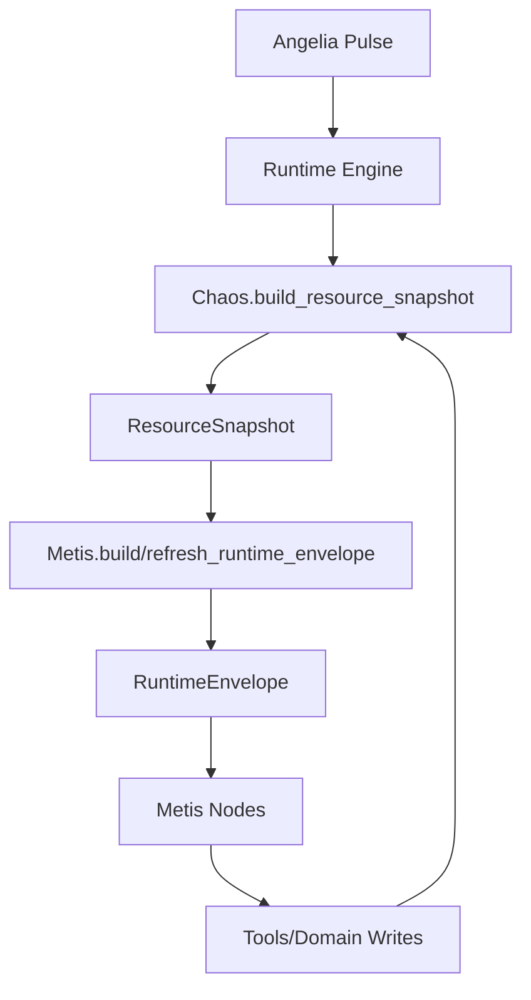

# Metis 策略层开发指南

## 1. 一句话定位
- `Chaos`：组织原料，产出 `ResourceSnapshot`
- `Metis`：消费原料，编排策略，产出 `RuntimeEnvelope`

## 2. 关键类型
- `Chaos Snapshot`：`/Users/qiuboyu/CodeLearning/Gods/gods/chaos/contracts.py`
- `Metis Envelope`：`/Users/qiuboyu/CodeLearning/Gods/gods/metis/contracts.py`
- `Metis Spec`：`/Users/qiuboyu/CodeLearning/Gods/gods/metis/strategy_specs.py`

## 3. 开发者最常用能力
### 3.1 构建 envelope
```python
from gods.metis.snapshot import build_runtime_envelope

env = build_runtime_envelope(agent, state, strategy="react_graph")
state["__metis_envelope"] = env
```

### 3.2 刷新 envelope（节点级）
```python
from gods.metis.snapshot import refresh_runtime_envelope

env = refresh_runtime_envelope(
    agent,
    state,
    strategy="react_graph",
    reason="before_llm_think",
)
```

### 3.3 使用 `snapshot.update()` 做增量覆盖
`ResourceSnapshot` 支持不可变更新：
```python
snap2 = env.resource_snapshot.update(
    runtime_meta={"node": "dispatch_tools", "note": "after_tool_write"},
    memory={"messages_in_state_count": 42},
)
```
说明：
- `dict` 字段：浅合并
- `list` 字段：整列替换
- 返回新对象，不修改原 `snapshot`

在 Metis 中可直接用：
```python
env = refresh_runtime_envelope(
    agent,
    state,
    reason="after_dispatch",
    snapshot_patch={
        "runtime_meta": {"refreshed_by": "dispatch_tools"}
    },
)
```

### 3.4 深层路径 patch（精确更新）
`ResourceSnapshot` 支持路径级 patch：
```python
snap2 = env.resource_snapshot.patch_path("runtime_meta.node.phase", "dispatch_tools")
snap3 = snap2.patch_paths({
    "memory.mailbox_intents_count": 9,
    "tool_catalog[0]": "read_file",
})
```
说明：
- 支持 `a.b.c` 和 `list_field[0]`
- 非法路径会抛 `ValueError`
- 返回新对象，不修改原对象

## 4. 推荐的节点刷新策略
- `pulse` 模式：每次 pulse 构建一次（默认）
- `node` 模式：每个节点执行前刷新一次（用于高实时性策略）

建议：
- 常规任务：`pulse`
- 强依赖实时 mailbox/contract 变更：`node`

`node` 模式下，Metis 会在刷新时调用 Chaos 增量拉取：
- Angelia：增量拉取该 agent 的 queued 事件并注入 `state.triggers`
- Iris：检测 pending 后拉取 mailbox intents 并注入 `state.mailbox`

## 5. 策略开发边界
1. 节点不要直接跨域拉取原料（Iris/Hermes/Mnemosyne）
2. 统一从 `__metis_envelope.resource_snapshot` 读取
3. 写入通过工具/领域服务完成，下一次刷新再读回
4. 跨模块访问必须走 `facade`，不要直接 import 对方 `store/models/internal`

## 6. 关系图


## 7. 最小策略接入清单
1. 在 `strategy_specs.py` 注册策略 id/phase/default tools
2. 在 runtime registry 注册 graph builder
3. 节点里统一读取 `__metis_envelope`
4. 按需要在节点前调用 `refresh_runtime_envelope(...)`
