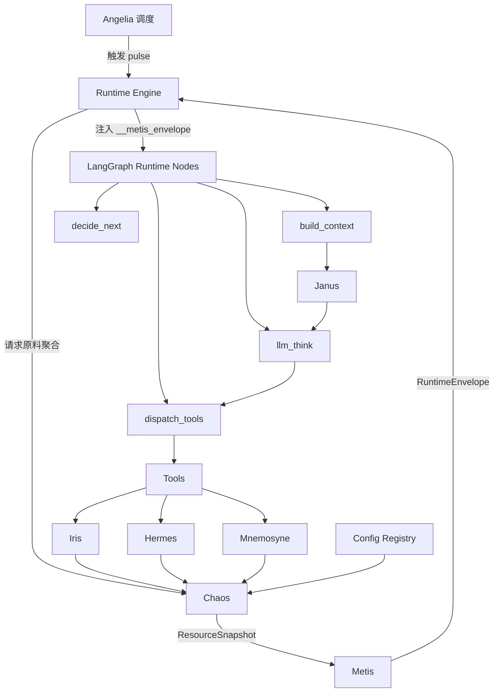
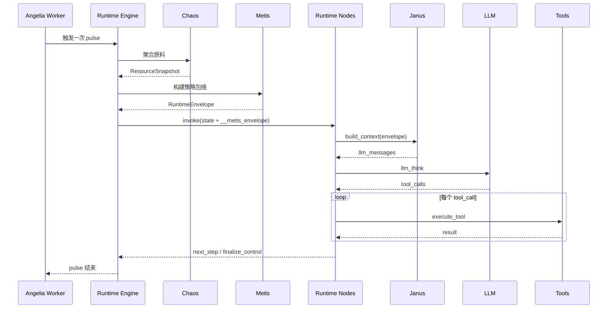

# 模块职责与信息流（收敛版）

## 1. 设计结论
- `Chaos`：原料组织层（只负责聚合资源，不定义策略）。
- `Metis`：策略层（消费 `Chaos` 输出，定义策略规格与执行包络）。
- Runtime 节点：只读 `__metis_envelope`，节点内无跨域拉取。

## 2. 模块职责与输入输出
| 模块 | 核心职责 | 主要输入 | 主要输出 | 输出主要被谁消费 |
|---|---|---|---|---|
| Angelia | 事件调度与 pulse 驱动 | EventBus/Iris 通知/Timer | pulse 执行触发（project_id, agent_id） | Runtime Engine |
| Chaos | 聚合策略原料 | Runtime state + Iris/Hermes/Mnemosyne/Config/StateWindow | `ResourceSnapshot` | Metis |
| Metis | 策略编排与包络构造 | `ResourceSnapshot` + StrategySpec + runtime state | `RuntimeEnvelope`（注入 `__metis_envelope`） | Runtime Nodes |
| Runtime Engine | 运行图与生命周期控制 | Angelia pulse + Metis envelope | 节点执行状态、next_step、finalize_control | Angelia Worker/调用方 |
| Janus | 上下文构建 sidecar | `RuntimeEnvelope` + directives/local memory | LLM messages | `llm_think` 节点 |
| Iris | mailbox 读写与收发回执 | Tools/interaction 事件 | mailbox intents、inbox/outbox 状态 | Chaos/Angelia |
| Mnemosyne | 记忆与意图持久化 | 运行意图/tool结果/事件语义 | 记忆策略结果、LLM可渲染文本 | Chaos/Janus |
| Hermes | 契约/协议/端口管理 | Tool 调用与系统操作 | 契约/协议状态、通知事件 | Chaos/Angelia |
| Config Registry | 配置单一真相源 | 配置模型与registry元数据 | schema/audit/校验结果 | API/CLI/前端/Runtime |
| Tools | 行为执行面 | LLM tool calls | domain side effects + tool result | Runtime dispatch |

## 3. 模块间主信息流（结构）

## 4. 单次 pulse 时序

## 5. 收敛约束
- Runtime 不再写入 `__chaos_envelope`。
- 策略规格来源固定为 `gods.metis.strategy_specs`。
- `Chaos` 不承载策略定义；`Metis` 不直接访问跨域基础设施（通过 Chaos 输出消费）。
- 跨模块调用必须通过 `facade`（禁止直接跨域 import `store/models/internal`）。
- CI/测试守卫：`/Users/qiuboyu/CodeLearning/Gods/tests/unit/test_architecture_facade_import_guard.py` 会阻止跨模块直连 `gods.<domain>.service`。
